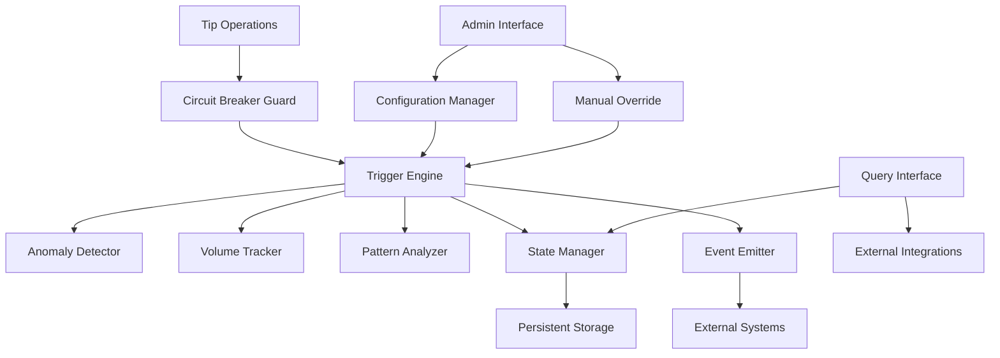

# Design Document: Enhanced Tip Circuit Breakers

## Overview

The enhanced tip circuit breakers system provides sophisticated automated protection against extreme market volatility, anomalous trading patterns, and potential attacks within the Stellar tipjar contracts. Building upon the existing basic circuit breaker implementation, this enhancement introduces multi-tier trigger conditions, advanced anomaly detection, granular cooldown management, and comprehensive monitoring capabilities.

The system operates as a protective layer that monitors tip activity in real-time and can temporarily halt operations when predefined thresholds are exceeded. Unlike simple on/off switches, these circuit breakers provide graduated responses based on the severity and type of detected anomalies, ensuring proportional protection while minimizing disruption to legitimate users.

Key design principles include:
- **Proportional Response**: Different trigger conditions result in appropriate halt durations
- **Minimal Overhead**: Circuit breaker checks add minimal gas cost to normal operations
- **Persistent State**: Protection remains active across contract upgrades and restarts
- **Administrative Control**: Comprehensive manual override capabilities for emergency situations
- **External Integration**: Rich query interface for dependent systems

## Architecture

### Core Components

The enhanced circuit breaker system consists of several interconnected components:



#### Circuit Breaker Guard
The primary entry point that intercepts all tip operations and performs rapid checks against current halt state. This component is optimized for minimal gas consumption and uses cached state data.

#### Trigger Engine
The central decision-making component that evaluates multiple trigger conditions simultaneously. It coordinates between different detection mechanisms and determines appropriate responses based on trigger severity.

#### Anomaly Detector
Advanced pattern recognition system that identifies suspicious activity patterns, including sender clustering, velocity anomalies, and correlation with external market events.

#### Volume Tracker
Efficient sliding window implementation that maintains cumulative volume statistics across multiple time horizons (1 minute, 5 minutes, 1 hour, 24 hours).

#### Configuration Manager
Handles all circuit breaker configuration including thresholds, cooldown periods, and creator-specific overrides. Validates configuration changes and manages migration during upgrades.

#### State Manager
Manages persistent storage of halt states, trigger history, and runtime statistics. Ensures state consistency across contract upgrades and handles recovery from corrupted state.

### Data Flow

1. **Normal Operation**: Tip operations pass through the Circuit Breaker Guard, which performs rapid checks against cached halt state
2. **Trigger Detection**: When thresholds are exceeded, the Trigger Engine evaluates severity and determines appropriate response
3. **Halt Activation**: State Manager persists halt state and Event Emitter publishes trigger events
4. **Ongoing Monitoring**: During halt periods, the system continues monitoring for additional triggers and manages cooldown timers
5. **Recovery**: Automatic or manual recovery updates state and emits recovery events

## Components and Interfaces

### Enhanced Configuration Structure

```rust
#[contracttype]
#[derive(Clone, Debug, Eq, PartialEq)]
pub struct EnhancedCircuitBreakerConfig {
    // Single tip thresholds
    pub max_single_tip: i128,
    pub creator_specific_limits: Map<Address, i128>,
    pub token_specific_limits: Map<Address, i128>,
    
    // Volume thresholds for different time windows
    pub volume_thresholds: VolumeThresholds,
    
    // Rate limiting
    pub max_tips_per_minute: u32,
    pub max_tips_per_creator_per_minute: u32,
    
    // Anomaly detection parameters
    pub anomaly_detection_enabled: bool,
    pub anomaly_confidence_threshold: u32, // basis points
    pub pattern_analysis_enabled: bool,
    
    // Cooldown configuration
    pub cooldown_config: CooldownConfig,
    
    // System flags
    pub enabled: bool,
    pub emergency_mode: bool,
    pub maintenance_mode: bool,
}

#[contracttype]
#[derive(Clone, Debug, Eq, PartialEq)]
pub struct VolumeThresholds {
    pub one_minute_threshold: i128,
    pub five_minute_threshold: i128,
    pub one_hour_threshold: i128,
    pub twenty_four_hour_threshold: i128,
    pub percentage_based_enabled: bool,
    pub historical_multiplier: u32, // basis points above historical average
}

#[contracttype]
#[derive(Clone, Debug, Eq, PartialEq)]
pub struct CooldownConfig {
    pub base_cooldown_seconds: u64,
    pub max_cooldown_seconds: u64,
    pub exponential_backoff_enabled: bool,
    pub backoff_multiplier: u32, // basis points
    pub severity_multipliers: Map<TriggerSeverity, u32>,
}
```

### Multi-Tier Trigger System

```rust
#[contracttype]
#[derive(Clone, Debug, Eq, PartialEq)]
pub enum TriggerType {
    SingleTipSpike,
    VolumeSpike(TimeWindow),
    RateLimit,
    AnomalyDetection,
    PatternAnalysis,
    PriceVolatility,
    Manual(String), // reason
}

#[contracttype]
#[derive(Clone, Debug, Eq, PartialEq)]
pub enum TriggerSeverity {
    Low,    // Short cooldown, minimal impact
    Medium, // Standard cooldown, normal halt
    High,   // Extended cooldown, comprehensive halt
    Critical, // Maximum cooldown, emergency procedures
}

#[contracttype]
#[derive(Clone, Debug, Eq, PartialEq)]
pub enum TimeWindow {
    OneMinute,
    FiveMinutes,
    OneHour,
    TwentyFourHours,
}
```

### Enhanced State Management

```rust
#[contracttype]
#[derive(Clone, Debug, Eq, PartialEq)]
pub struct EnhancedCircuitBreakerState {
    // Current halt status
    pub halted_until: u64,
    pub halt_reason: Option<TriggerType>,
    pub halt_severity: Option<TriggerSeverity>,
    
    // Volume tracking across time windows
    pub volume_windows: Map<TimeWindow, VolumeWindow>,
    
    // Rate limiting state
    pub rate_limit_state: RateLimitState,
    
    // Trigger history
    pub trigger_count: u32,
    pub last_trigger_time: u64,
    pub trigger_history: Vec<TriggerEvent>,
    
    // Anomaly detection state
    pub anomaly_state: AnomalyDetectionState,
    
    // Statistics
    pub total_halts: u32,
    pub total_halt_duration: u64,
    pub false_positive_count: u32,
}

#[contracttype]
#[derive(Clone, Debug, Eq, PartialEq)]
pub struct VolumeWindow {
    pub window_start: u64,
    pub current_volume: i128,
    pub tip_count: u32,
    pub unique_senders: u32,
    pub max_single_tip: i128,
}

#[contracttype]
#[derive(Clone, Debug, Eq, PartialEq)]
pub struct RateLimitState {
    pub current_minute_start: u64,
    pub tips_this_minute: u32,
    pub creator_tip_counts: Map<Address, u32>,
    pub sender_tip_counts: Map<Address, u32>,
}
```

### Anomaly Detection Engine

```rust
#[contracttype]
#[derive(Clone, Debug, Eq, PartialEq)]
pub struct AnomalyDetectionState {
    // Historical statistics for comparison
    pub historical_stats: HistoricalStats,
    
    // Current pattern analysis
    pub sender_clustering_score: u32,
    pub velocity_anomaly_score: u32,
    pub amount_deviation_score: u32,
    
    // Pattern tracking
    pub recent_senders: Vec<Address>,
    pub recent_amounts: Vec<i128>,
    pub recent_timestamps: Vec<u64>,
    
    // Confidence calculation
    pub overall_confidence: u32, // basis points
    pub last_analysis_time: u64,
}

#[contracttype]
#[derive(Clone, Debug, Eq, PartialEq)]
pub struct HistoricalStats {
    pub average_tip_amount: i128,
    pub standard_deviation: i128,
    pub average_tips_per_minute: u32,
    pub unique_senders_per_hour: u32,
    pub last_update: u64,
    pub sample_count: u32,
}
```

### Administrative Interface

```rust
pub trait CircuitBreakerAdmin {
    // Configuration management
    fn set_enhanced_config(env: &Env, admin: &Address, config: &EnhancedCircuitBreakerConfig);
    fn get_enhanced_config(env: &Env) -> Option<EnhancedCircuitBreakerConfig>;
    
    // Manual override capabilities
    fn manual_trigger(env: &Env, admin: &Address, reason: &String, severity: &TriggerSeverity);
    fn manual_reset(env: &Env, admin: &Address, force: bool);
    fn extend_halt(env: &Env, admin: &Address, additional_seconds: u64);
    
    // Emergency controls
    fn enable_emergency_mode(env: &Env, admin: &Address, reason: &String);
    fn disable_emergency_mode(env: &Env, admin: &Address);
    fn enable_maintenance_mode(env: &Env, admin: &Address);
    fn disable_maintenance_mode(env: &Env, admin: &Address);
    
    // Creator-specific overrides
    fn set_creator_limits(env: &Env, admin: &Address, creator: &Address, limits: &CreatorLimits);
    fn remove_creator_limits(env: &Env, admin: &Address, creator: &Address);
}
```

### Query Interface for External Systems

```rust
pub trait CircuitBreakerQuery {
    // Status queries
    fn is_halted(env: &Env) -> bool;
    fn get_halt_status(env: &Env) -> HaltStatus;
    fn get_remaining_cooldown(env: &Env) -> u64;
    
    // Statistics queries
    fn get_current_volume_stats(env: &Env) -> Map<TimeWindow, VolumeWindow>;
    fn get_trigger_history(env: &Env, limit: u32) -> Vec<TriggerEvent>;
    fn get_anomaly_scores(env: &Env) -> AnomalyScores;
    
    // Batch queries for efficiency
    fn get_creator_status_batch(env: &Env, creators: &Vec<Address>) -> Map<Address, CreatorStatus>;
    fn get_token_status_batch(env: &Env, tokens: &Vec<Address>) -> Map<Address, TokenStatus>;
    
    // Estimation functions
    fn estimate_recovery_time(env: &Env) -> u64;
    fn estimate_gas_cost(env: &Env, operation: &OperationType) -> u64;
}
```

## Data Models

### Event Structures

```rust
#[contracttype]
#[derive(Clone, Debug, Eq, PartialEq)]
pub struct TriggerEvent {
    pub trigger_id: u64,
    pub trigger_type: TriggerType,
    pub severity: TriggerSeverity,
    pub timestamp: u64,
    pub triggering_admin: Option<Address>,
    pub affected_operations: Vec<OperationType>,
    pub cooldown_duration: u64,
    pub volume_stats: Option<VolumeSnapshot>,
    pub anomaly_scores: Option<AnomalyScores>,
}

#[contracttype]
#[derive(Clone, Debug, Eq, PartialEq)]
pub struct RecoveryEvent {
    pub recovery_id: u64,
    pub recovery_type: RecoveryType, // Automatic or Manual
    pub timestamp: u64,
    pub recovering_admin: Option<Address>,
    pub halt_duration: u64,
    pub trigger_count_during_halt: u32,
}

#[contracttype]
#[derive(Clone, Debug, Eq, PartialEq)]
pub enum RecoveryType {
    Automatic,
    ManualReset,
    ManualForce,
    EmergencyOverride,
}
```

### Storage Optimization

The system uses a hierarchical storage approach to optimize gas costs:

1. **Hot Storage** (Instance): Current halt state, active volume windows
2. **Warm Storage** (Persistent): Configuration, recent trigger history
3. **Cold Storage** (Temporary): Historical statistics, archived events

```rust
#[contracttype]
#[derive(Clone, Debug, Eq, PartialEq)]
pub enum EnhancedCircuitBreakerKey {
    // Hot storage - frequently accessed
    Config,
    State,
    CurrentVolumes,
    
    // Warm storage - moderately accessed
    TriggerHistory(u64),
    AnomalyState,
    CreatorLimits(Address),
    TokenLimits(Address),
    
    // Cold storage - rarely accessed
    HistoricalStats,
    ArchivedEvents(u64),
    PerformanceMetrics,
}
```

## Correctness Properties

*A property is a characteristic or behavior that should hold true across all valid executions of a system-essentially, a formal statement about what the system should do. Properties serve as the bridge between human-readable specifications and machine-verifiable correctness guarantees.*

Before writing the correctness properties, I need to analyze the acceptance criteria to determine which ones are suitable for property-based testing.

### Property 1: Configuration Round-Trip Consistency
*For any* valid circuit breaker configuration, storing and then retrieving the configuration should return identical values
**Validates: Requirements 1.1, 1.2, 1.3, 1.4, 1.5, 1.6, 1.7**

### Property 2: Invalid Configuration Rejection
*For any* invalid configuration parameters, the circuit breaker should reject the configuration with appropriate error codes
**Validates: Requirements 1.8**

### Property 3: Single Tip Spike Triggering
*For any* tip amount exceeding the configured single tip threshold, the circuit breaker should trigger an immediate halt
**Validates: Requirements 2.1**

### Property 4: Volume-Based Triggering Consistency
*For any* sequence of tips that causes cumulative volume to exceed configured thresholds within time windows, the circuit breaker should trigger halts with severity corresponding to the time window
**Validates: Requirements 2.2, 2.3, 2.4**

### Property 5: Rate Limiting Enforcement
*For any* sequence of tips exceeding configured rate limits, the circuit breaker should trigger rate-limiting halts
**Validates: Requirements 2.5**

### Property 6: Anomaly Pattern Detection
*For any* tip sequence exhibiting unusual sender clustering or velocity patterns, the anomaly detector should calculate appropriate confidence scores and trigger when thresholds are exceeded
**Validates: Requirements 2.6, 6.1, 6.2, 6.3, 6.4, 6.7, 6.8**

### Property 7: Cooldown Period Assignment
*For any* circuit breaker trigger, the system should assign cooldown periods that match the configured severity levels for the trigger type
**Validates: Requirements 2.8, 7.1**

### Property 8: Operation Blocking During Halts
*For any* active halt state, tip and withdrawal operations should be rejected while read-only operations continue to function
**Validates: Requirements 3.1, 3.2, 3.3**

### Property 9: Error Code Consistency
*For any* blocked operation during halt states, the system should return specific error codes indicating circuit breaker activation
**Validates: Requirements 3.4**

### Property 10: State Preservation During Halts
*For any* halt period, all existing balances and system state should remain unchanged throughout the halt duration
**Validates: Requirements 3.5**

### Property 11: Automatic Recovery After Cooldown
*For any* triggered circuit breaker with a defined cooldown period, operations should automatically resume when the cooldown expires
**Validates: Requirements 3.6**

### Property 12: Volume Counter Reset on Recovery
*For any* circuit breaker recovery, volume counters should be reset to enable fresh monitoring
**Validates: Requirements 3.7**

### Property 13: Manual Trigger and Reset Functionality
*For any* admin-initiated manual trigger or reset, the circuit breaker should respond appropriately and record the admin action in audit trails
**Validates: Requirements 4.1, 4.2, 4.5**

### Property 14: Halt Extension Capability
*For any* active halt with admin-requested extension, the cooldown period should be extended by the specified additional time
**Validates: Requirements 4.3**

### Property 15: Reset Validation Timing
*For any* manual reset attempt, the system should validate that sufficient time has elapsed since trigger before allowing the reset
**Validates: Requirements 4.6**

### Property 16: Bypass Mode Operation
*For any* configured bypass mode during halts, specified operations should continue to function while others remain blocked
**Validates: Requirements 4.7**

### Property 17: Maintenance Mode Blocking
*For any* maintenance mode activation, all operations should be blocked indefinitely until maintenance mode is disabled
**Validates: Requirements 4.8**

### Property 18: Event Emission Completeness
*For any* circuit breaker trigger, reset, or recovery, appropriate events should be emitted containing all required information including timestamps, reasons, severity, and relevant context
**Validates: Requirements 5.1, 5.2, 5.3, 5.4, 5.5, 5.6, 5.7**

### Property 19: Periodic Status Event Emission
*For any* extended halt period, periodic status events should be emitted at configured intervals
**Validates: Requirements 5.8**

### Property 20: Rolling Statistics Maintenance
*For any* sequence of tips over time, rolling statistics should be maintained correctly for pattern comparison and anomaly detection
**Validates: Requirements 6.6**

### Property 21: Exponential Backoff for Repeated Triggers
*For any* sequence of repeated triggers within short timeframes, cooldown periods should increase exponentially according to configured backoff parameters
**Validates: Requirements 7.2**

### Property 22: Cooldown Bounds Enforcement
*For any* calculated cooldown period, the result should respect configured minimum and maximum bounds
**Validates: Requirements 7.3**

### Property 23: Longest Cooldown Selection for Simultaneous Triggers
*For any* set of simultaneous triggers with different cooldown requirements, the system should use the longest applicable cooldown period
**Validates: Requirements 7.5**

### Property 24: History-Influenced Cooldown Calculation
*For any* trigger with existing trigger history, future cooldown calculations should be influenced by historical patterns according to configured parameters
**Validates: Requirements 7.6**

### Property 25: Creator-Specific Override Application
*For any* creator with configured overrides, circuit breaker behavior should apply the creator-specific limits and cooldown periods
**Validates: Requirements 7.7**

### Property 26: State Persistence Round-Trip
*For any* circuit breaker state (halt status, configuration, history), persisting and then retrieving the state should return identical values
**Validates: Requirements 8.1, 8.2, 8.3**

### Property 27: State Restoration After Initialization
*For any* persisted active halt state, contract initialization should restore the halt state correctly
**Validates: Requirements 8.4**

### Property 28: State Integrity Validation
*For any* state validation during initialization, corrupted or invalid state should be detected and handled with safe defaults
**Validates: Requirements 8.6, 8.7**

### Property 29: Audit Trail Completeness
*For any* state change in the circuit breaker system, an appropriate audit trail entry should be recorded with complete information
**Validates: Requirements 8.8**

### Property 30: Query Function Accuracy
*For any* circuit breaker state, query functions should return accurate information about halt status, cooldown times, trigger history, and volume metrics
**Validates: Requirements 9.1, 9.2, 9.3, 9.4**

### Property 31: Event Emission for External Systems
*For any* circuit breaker activity, events should be emitted in formats suitable for external system consumption
**Validates: Requirements 9.5**

### Property 32: Batch Query Consistency
*For any* batch query request, results should be consistent with individual queries and efficiently processed
**Validates: Requirements 9.6**

### Property 33: Standardized Status Code Usage
*For any* circuit breaker condition, standardized status codes should be returned consistently for integration compatibility
**Validates: Requirements 9.7**

### Property 34: Recovery Time Estimation Accuracy
*For any* active halt condition, estimated recovery times should be calculated accurately based on current cooldown parameters
**Validates: Requirements 9.8**

### Property 35: Caching Effectiveness
*For any* frequently accessed configuration or state data, caching should reduce storage read operations while maintaining data consistency
**Validates: Requirements 10.2**

### Property 36: State Update Batching
*For any* sequence of related state changes, updates should be batched efficiently to minimize storage operations
**Validates: Requirements 10.4**

### Property 37: Conditional Check Optimization
*For any* operation when circuit breakers are disabled, unnecessary checks should be skipped to optimize performance
**Validates: Requirements 10.5**

### Property 38: Lazy Evaluation for Complex Detection
*For any* condition requiring complex anomaly detection, evaluation should only be performed when necessary to optimize gas usage
**Validates: Requirements 10.7**

### Property 39: Gas Estimation Accuracy
*For any* circuit breaker operation, gas estimation functions should provide accurate estimates for integration planning
**Validates: Requirements 10.8**

## Error Handling

The enhanced circuit breaker system implements comprehensive error handling across multiple layers:

### Configuration Errors
- **Invalid Thresholds**: Negative values, zero cooldowns, or thresholds that would cause immediate triggering
- **Conflicting Settings**: Creator overrides that conflict with global settings
- **Range Violations**: Values outside acceptable ranges for time windows or percentages

### Runtime Errors
- **State Corruption**: Graceful handling of corrupted persistent state with fallback to safe defaults
- **Timing Issues**: Handling of clock skew and timestamp inconsistencies
- **Resource Exhaustion**: Proper handling when storage limits are approached

### Integration Errors
- **Oracle Failures**: Fallback behavior when external price feeds are unavailable
- **Event Emission Failures**: Retry mechanisms for critical event publishing
- **Query Timeouts**: Efficient handling of complex queries that may timeout

### Administrative Errors
- **Unauthorized Access**: Proper validation of admin privileges for sensitive operations
- **Invalid Manual Overrides**: Validation of manual trigger and reset requests
- **Configuration Conflicts**: Detection and resolution of conflicting administrative actions

## Testing Strategy

The testing strategy employs a dual approach combining property-based testing for core logic with integration testing for external dependencies and performance characteristics.

### Property-Based Testing
- **Minimum 100 iterations** per property test to ensure comprehensive input coverage
- **Randomized input generation** for configurations, tip sequences, and timing scenarios
- **State-based testing** to verify system behavior across different operational states
- **Invariant checking** to ensure system properties hold across all valid executions

Each property test references its corresponding design document property using the tag format:
**Feature: tip-circuit-breakers, Property {number}: {property_text}**

### Integration Testing
- **Oracle Integration**: Testing with mocked external price feeds and market data
- **Performance Testing**: Gas consumption measurement and optimization validation
- **Upgrade Testing**: State migration and persistence across contract versions
- **Multi-signature Testing**: Emergency mode and administrative override scenarios

### Unit Testing
- **Configuration Validation**: Specific examples of valid and invalid configurations
- **Edge Cases**: Boundary conditions for thresholds, time windows, and cooldown periods
- **Error Scenarios**: Specific error conditions and recovery mechanisms
- **Administrative Functions**: Concrete examples of manual overrides and emergency procedures

### Test Environment Setup
The testing environment includes:
- **Mock Oracle Services**: Simulated price feeds for volatility testing
- **Time Manipulation**: Controlled advancement of blockchain time for cooldown testing
- **Multi-Admin Setup**: Multiple administrative addresses for governance testing
- **High-Volume Simulation**: Stress testing with large numbers of tips and creators

### Performance Benchmarks
- **Gas Consumption**: Circuit breaker checks should add less than 5% overhead to normal tip operations
- **Query Performance**: Batch queries should scale linearly with request size
- **Event Emission**: Event publishing should not significantly impact transaction costs
- **State Updates**: Batched updates should reduce storage operations by at least 50%

The testing strategy ensures that the enhanced circuit breaker system provides robust protection while maintaining high performance and reliability standards required for production DeFi applications.