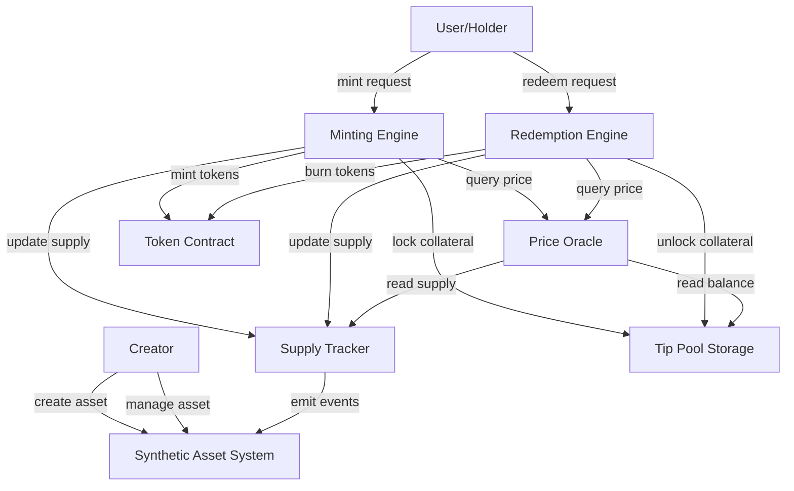
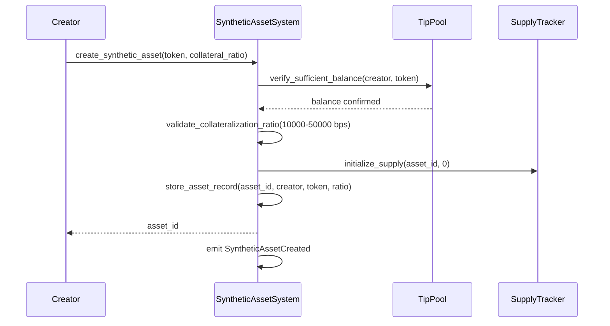
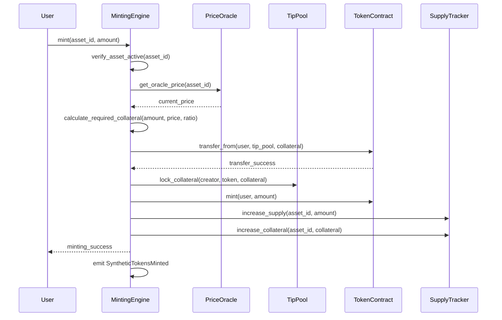
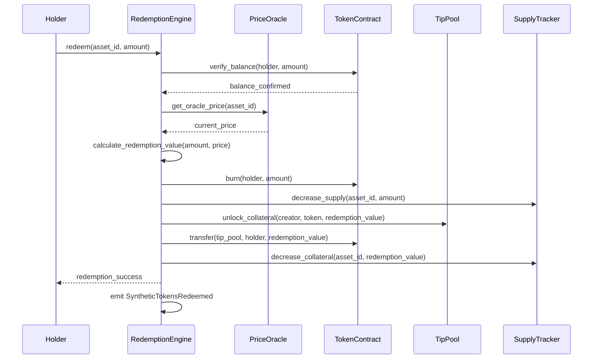

# Design Document: Tip Synthetic Assets

## Overview

The Tip Synthetic Assets system introduces a mechanism for creating tokenized exposure to creator performance through synthetic assets backed by tip pools. This feature enables users to mint synthetic tokens representing fractional ownership or exposure to a creator's tip pool, providing creators with upfront liquidity while allowing users to speculate on creator success.

The system consists of four primary components:

1. **Minting Engine**: Handles the creation of new synthetic tokens by accepting collateral and calculating appropriate token amounts based on oracle prices and collateralization ratios
2. **Redemption Engine**: Manages the burning of synthetic tokens and distribution of underlying value back to token holders
3. **Price Oracle**: Calculates real-time valuations of synthetic assets based on tip pool performance metrics
4. **Supply Tracker**: Monitors and records synthetic token supply, collateral amounts, and collateralization ratios

The design integrates seamlessly with the existing TipJar contract infrastructure, leveraging the established tip pool system, token management, and access control mechanisms.

### Key Design Principles

- **Collateralization Safety**: All synthetic assets must maintain minimum collateralization ratios to protect both creators and synthetic token holders
- **Price Transparency**: Oracle prices are calculated deterministically from on-chain tip pool data
- **Creator Control**: Creators retain control over their synthetic assets with the ability to pause, resume, and adjust parameters
- **Integration First**: The system builds upon existing TipJar infrastructure rather than creating parallel systems

## Architecture

### High-Level Component Diagram



### System Flow

#### Synthetic Asset Creation Flow



#### Minting Flow



#### Redemption Flow



## Components and Interfaces

### 1. Synthetic Asset Data Structure

The core data structure representing a synthetic asset:

```rust
#[contracttype]
#[derive(Clone, Debug, Eq, PartialEq)]
pub struct SyntheticAsset {
    /// Unique identifier for this synthetic asset
    pub asset_id: u64,
    
    /// Creator whose tip pool backs this asset
    pub creator: Address,
    
    /// Token address of the backing collateral
    pub backing_token: Address,
    
    /// Total supply of synthetic tokens minted
    pub total_supply: i128,
    
    /// Collateralization ratio in basis points (10000 = 100%)
    /// Valid range: 10000-50000 (100%-500%)
    pub collateralization_ratio: u32,
    
    /// Timestamp when the asset was created
    pub created_at: u64,
    
    /// Current oracle price (backing_token per synthetic_token)
    pub oracle_price: i128,
    
    /// Total collateral locked in tip pool
    pub total_collateral: i128,
    
    /// Whether the asset is active (true) or paused (false)
    pub active: bool,
}
```

### 2. Minting Engine Interface

```rust
pub trait MintingEngine {
    /// Mints synthetic tokens by providing collateral
    ///
    /// # Parameters
    /// - `env`: Soroban environment
    /// - `user`: Address requesting to mint tokens
    /// - `asset_id`: Identifier of the synthetic asset
    /// - `amount`: Amount of synthetic tokens to mint
    ///
    /// # Returns
    /// - Amount of collateral required and transferred
    ///
    /// # Errors
    /// - `SyntheticAssetInactive`: Asset is paused
    /// - `InsufficientCollateral`: User provided insufficient collateral
    /// - `InvalidAmount`: Amount is zero or negative
    fn mint(
        env: &Env,
        user: &Address,
        asset_id: u64,
        amount: i128,
    ) -> Result<i128, TipJarError>;
    
    /// Calculates required collateral for a minting amount
    ///
    /// # Parameters
    /// - `env`: Soroban environment
    /// - `asset_id`: Identifier of the synthetic asset
    /// - `amount`: Amount of synthetic tokens to mint
    ///
    /// # Returns
    /// - Required collateral amount
    fn calculate_required_collateral(
        env: &Env,
        asset_id: u64,
        amount: i128,
    ) -> i128;
}
```

### 3. Redemption Engine Interface

```rust
pub trait RedemptionEngine {
    /// Redeems synthetic tokens for underlying value
    ///
    /// # Parameters
    /// - `env`: Soroban environment
    /// - `holder`: Address redeeming tokens
    /// - `asset_id`: Identifier of the synthetic asset
    /// - `amount`: Amount of synthetic tokens to redeem
    ///
    /// # Returns
    /// - Redemption value transferred to holder
    ///
    /// # Errors
    /// - `InsufficientBalance`: Holder doesn't own enough tokens
    /// - `InsufficientPoolBalance`: Tip pool lacks funds for redemption
    /// - `InvalidAmount`: Amount is zero or negative
    fn redeem(
        env: &Env,
        holder: &Address,
        asset_id: u64,
        amount: i128,
    ) -> Result<i128, TipJarError>;
    
    /// Calculates redemption value for a token amount
    ///
    /// # Parameters
    /// - `env`: Soroban environment
    /// - `asset_id`: Identifier of the synthetic asset
    /// - `amount`: Amount of synthetic tokens
    ///
    /// # Returns
    /// - Redemption value in backing tokens
    fn calculate_redemption_value(
        env: &Env,
        asset_id: u64,
        amount: i128,
    ) -> i128;
}
```

### 4. Price Oracle Interface

```rust
pub trait PriceOracle {
    /// Calculates and updates the oracle price for a synthetic asset
    ///
    /// # Parameters
    /// - `env`: Soroban environment
    /// - `asset_id`: Identifier of the synthetic asset
    ///
    /// # Returns
    /// - Updated oracle price
    ///
    /// # Formula
    /// - If total_supply > 0: price = tip_pool_balance / total_supply
    /// - If total_supply == 0: price = 1 unit of backing token
    fn update_oracle_price(
        env: &Env,
        asset_id: u64,
    ) -> i128;
    
    /// Retrieves the current oracle price without updating
    ///
    /// # Parameters
    /// - `env`: Soroban environment
    /// - `asset_id`: Identifier of the synthetic asset
    ///
    /// # Returns
    /// - Current oracle price
    fn get_oracle_price(
        env: &Env,
        asset_id: u64,
    ) -> i128;
}
```

### 5. Supply Tracker Interface

```rust
pub trait SupplyTracker {
    /// Updates total supply after minting or redemption
    ///
    /// # Parameters
    /// - `env`: Soroban environment
    /// - `asset_id`: Identifier of the synthetic asset
    /// - `delta`: Change in supply (positive for mint, negative for redeem)
    fn update_supply(
        env: &Env,
        asset_id: u64,
        delta: i128,
    );
    
    /// Updates total collateral after operations
    ///
    /// # Parameters
    /// - `env`: Soroban environment
    /// - `asset_id`: Identifier of the synthetic asset
    /// - `delta`: Change in collateral (positive for lock, negative for unlock)
    fn update_collateral(
        env: &Env,
        asset_id: u64,
        delta: i128,
    );
    
    /// Calculates current collateralization ratio
    ///
    /// # Parameters
    /// - `env`: Soroban environment
    /// - `asset_id`: Identifier of the synthetic asset
    ///
    /// # Returns
    /// - Current collateralization ratio in basis points
    ///
    /// # Formula
    /// - ratio = (total_collateral / (total_supply * oracle_price)) * 10000
    fn get_collateralization_ratio(
        env: &Env,
        asset_id: u64,
    ) -> u32;
    
    /// Retrieves total supply for an asset
    fn get_total_supply(
        env: &Env,
        asset_id: u64,
    ) -> i128;
    
    /// Retrieves total collateral for an asset
    fn get_total_collateral(
        env: &Env,
        asset_id: u64,
    ) -> i128;
}
```

### 6. Administration Interface

```rust
pub trait SyntheticAssetAdmin {
    /// Creates a new synthetic asset
    ///
    /// # Parameters
    /// - `env`: Soroban environment
    /// - `creator`: Creator address
    /// - `backing_token`: Token address for collateral
    /// - `collateralization_ratio`: Ratio in basis points (10000-50000)
    ///
    /// # Returns
    /// - New asset identifier
    ///
    /// # Errors
    /// - `InsufficientCollateral`: Creator's tip pool balance too low
    /// - `InvalidCollateralizationRatio`: Ratio outside valid range
    fn create_synthetic_asset(
        env: &Env,
        creator: &Address,
        backing_token: &Address,
        collateralization_ratio: u32,
    ) -> Result<u64, TipJarError>;
    
    /// Pauses a synthetic asset (prevents new minting)
    ///
    /// # Parameters
    /// - `env`: Soroban environment
    /// - `creator`: Creator address (must match asset creator)
    /// - `asset_id`: Identifier of the synthetic asset
    ///
    /// # Errors
    /// - `Unauthorized`: Caller is not the creator
    fn pause_synthetic_asset(
        env: &Env,
        creator: &Address,
        asset_id: u64,
    ) -> Result<(), TipJarError>;
    
    /// Resumes a paused synthetic asset
    ///
    /// # Parameters
    /// - `env`: Soroban environment
    /// - `creator`: Creator address (must match asset creator)
    /// - `asset_id`: Identifier of the synthetic asset
    ///
    /// # Errors
    /// - `Unauthorized`: Caller is not the creator
    /// - `CollateralizationViolation`: Collateralization below minimum
    fn resume_synthetic_asset(
        env: &Env,
        creator: &Address,
        asset_id: u64,
    ) -> Result<(), TipJarError>;
    
    /// Updates collateralization ratio for future minting
    ///
    /// # Parameters
    /// - `env`: Soroban environment
    /// - `creator`: Creator address (must match asset creator)
    /// - `asset_id`: Identifier of the synthetic asset
    /// - `new_ratio`: New ratio in basis points (10000-50000)
    ///
    /// # Errors
    /// - `Unauthorized`: Caller is not the creator
    /// - `InvalidCollateralizationRatio`: Ratio outside valid range
    fn update_collateralization_ratio(
        env: &Env,
        creator: &Address,
        asset_id: u64,
        new_ratio: u32,
    ) -> Result<(), TipJarError>;
    
    /// Adds collateral to improve collateralization ratio
    ///
    /// # Parameters
    /// - `env`: Soroban environment
    /// - `creator`: Creator address
    /// - `asset_id`: Identifier of the synthetic asset
    /// - `amount`: Amount of collateral to add
    fn add_collateral(
        env: &Env,
        creator: &Address,
        asset_id: u64,
        amount: i128,
    ) -> Result<(), TipJarError>;
}
```

### 7. Query Interface

```rust
pub trait SyntheticAssetQuery {
    /// Retrieves synthetic asset details
    fn get_synthetic_asset(
        env: &Env,
        asset_id: u64,
    ) -> Result<SyntheticAsset, TipJarError>;
    
    /// Retrieves all synthetic assets for a creator
    fn get_creator_synthetic_assets(
        env: &Env,
        creator: &Address,
    ) -> Vec<u64>;
    
    /// Retrieves holder balance for a synthetic asset
    fn get_holder_balance(
        env: &Env,
        asset_id: u64,
        holder: &Address,
    ) -> i128;
}
```

## Data Models

### Storage Keys

New storage keys to be added to the existing `DataKey` enum:

```rust
#[derive(Clone)]
#[contracttype]
pub enum DataKey {
    // ... existing keys ...
    
    /// Synthetic asset record by asset ID
    SyntheticAsset(u64),
    
    /// Global counter for synthetic asset IDs
    SyntheticAssetCounter,
    
    /// List of synthetic asset IDs for a creator
    CreatorSyntheticAssets(Address),
    
    /// Locked collateral amount per creator per token for synthetic assets
    SyntheticCollateral(Address, Address), // (creator, token)
    
    /// Synthetic token balance per holder per asset
    SyntheticBalance(Address, u64), // (holder, asset_id)
}
```

### Error Codes

New error codes to be added to the existing `TipJarError` enum:

```rust
#[contracterror]
#[derive(Copy, Clone, Debug, Eq, PartialEq, PartialOrd, Ord)]
#[repr(u32)]
pub enum TipJarError {
    // ... existing errors ...
    
    /// Synthetic asset not found
    SyntheticAssetNotFound = 98,
    
    /// Synthetic asset is inactive/paused
    SyntheticAssetInactive = 99,
    
    /// Invalid collateralization ratio (must be 10000-50000 bps)
    InvalidCollateralizationRatio = 100,
    
    /// Collateralization ratio violation
    CollateralizationViolation = 101,
    
    /// Token not in creator's tip pool
    TokenNotInPool = 102,
    
    /// Insufficient pool balance for redemption
    InsufficientPoolBalance = 103,
}
```

### Event Definitions

```rust
/// Emitted when a synthetic asset is created
pub struct SyntheticAssetCreatedEvent {
    pub asset_id: u64,
    pub creator: Address,
    pub backing_token: Address,
    pub collateralization_ratio: u32,
    pub timestamp: u64,
}

/// Emitted when synthetic tokens are minted
pub struct SyntheticTokensMintedEvent {
    pub asset_id: u64,
    pub minter: Address,
    pub amount: i128,
    pub collateral_provided: i128,
    pub timestamp: u64,
}

/// Emitted when synthetic tokens are redeemed
pub struct SyntheticTokensRedeemedEvent {
    pub asset_id: u64,
    pub redeemer: Address,
    pub amount: i128,
    pub value_received: i128,
    pub timestamp: u64,
}

/// Emitted when oracle price is updated
pub struct PriceUpdatedEvent {
    pub asset_id: u64,
    pub new_price: i128,
    pub timestamp: u64,
}

/// Emitted when total supply changes
pub struct SupplyUpdatedEvent {
    pub asset_id: u64,
    pub new_total_supply: i128,
    pub timestamp: u64,
}

/// Emitted when total collateral changes
pub struct CollateralUpdatedEvent {
    pub asset_id: u64,
    pub new_total_collateral: i128,
    pub timestamp: u64,
}

/// Emitted when a synthetic asset is paused
pub struct SyntheticAssetPausedEvent {
    pub asset_id: u64,
    pub timestamp: u64,
}

/// Emitted when a synthetic asset is resumed
pub struct SyntheticAssetResumedEvent {
    pub asset_id: u64,
    pub timestamp: u64,
}

/// Emitted when collateralization ratio is updated
pub struct CollateralizationUpdatedEvent {
    pub asset_id: u64,
    pub new_ratio: u32,
    pub timestamp: u64,
}
```

## Correctness Properties

*A property is a characteristic or behavior that should hold true across all valid executions of a system—essentially, a formal statement about what the system should do. Properties serve as the bridge between human-readable specifications and machine-verifiable correctness guarantees.*

Before defining the correctness properties, I need to analyze the acceptance criteria to determine which are suitable for property-based testing.


### Property Reflection

After analyzing all 95 acceptance criteria, I've identified the following areas of redundancy:

**Redundancy Analysis:**

1. **Event Emission Properties**: Many requirements specify that events must be emitted for specific operations (e.g., 2.6, 3.7, 4.5, 5.7, 6.9, 6.10, 7.7, 8.8, 8.9). These can be consolidated into comprehensive properties that verify event emission for all operations of a given type.

2. **Supply and Collateral Tracking**: Requirements 3.5, 3.6, 5.4, 5.6, 6.1, 6.2, 6.4, 6.5 all relate to supply and collateral tracking. These can be combined into properties about invariant maintenance across all operations.

3. **Validation Properties**: Requirements 2.1, 2.2, 3.1, 5.1, 7.1, 7.2, 8.4, 8.6 all involve validation checks. These can be consolidated into properties about validation consistency.

4. **Error Handling**: Requirements 2.7, 2.8, 3.8, 3.9, 5.8, 5.9, 7.8, 8.10, 9.10, 11.9, 12.9 all specify error returns. These can be combined into properties about error handling consistency.

5. **Query Functions**: Requirements 9.1-9.8 all relate to query functionality. These can be consolidated into properties about query correctness.

6. **Authorization**: Requirements 8.10, 12.1, 12.2, 12.3, 12.9 all relate to authorization checks. These can be combined into comprehensive authorization properties.

7. **State Initialization**: Requirements 2.4 and 2.5 both relate to initial state of created assets and can be combined.

8. **Pause Behavior**: Requirements 8.2, 8.3, 9.9, 12.10 all relate to behavior during pause state and can be consolidated.

**Consolidated Property Set:**

After reflection, the following unique properties provide comprehensive coverage without redundancy:

### Property 1: Unique Asset Identifiers

*For any* sequence of synthetic asset creation operations, all assigned asset identifiers SHALL be unique.

**Validates: Requirements 1.8**

### Property 2: Asset Creation Initialization Invariants

*For any* newly created synthetic asset, the total supply SHALL be zero AND the active status SHALL be true.

**Validates: Requirements 2.4, 2.5**

### Property 3: Collateralization Ratio Validation

*For any* synthetic asset creation or ratio update request, the system SHALL accept the request if and only if the collateralization ratio is between 10000 and 50000 basis points (inclusive).

**Validates: Requirements 2.2, 8.6**

### Property 4: Sufficient Balance Validation

*For any* synthetic asset creation request, the system SHALL verify that the creator's tip pool balance for the backing token is sufficient to support the minimum collateral requirements.

**Validates: Requirements 2.1**

### Property 5: Collateral Calculation Correctness

*For any* minting request with amount A, oracle price P, and collateralization ratio R, the required collateral SHALL equal (A × P × R) / 10000.

**Validates: Requirements 3.2, 9.6**

### Property 6: Redemption Value Calculation Correctness

*For any* redemption request with amount A and oracle price P, the redemption value SHALL equal A × P.

**Validates: Requirements 5.2, 9.7**

### Property 7: Supply Tracking Invariant

*For any* sequence of minting and redemption operations on a synthetic asset, the total supply SHALL equal the sum of all minted amounts minus the sum of all redeemed amounts.

**Validates: Requirements 3.5, 5.4, 6.1, 6.4**

### Property 8: Collateral Tracking Invariant

*For any* sequence of minting, redemption, and collateral addition operations on a synthetic asset, the total collateral SHALL equal the sum of all collateral locked minus the sum of all collateral unlocked.

**Validates: Requirements 3.6, 5.6, 6.2, 6.5, 7.6**

### Property 9: Oracle Price Calculation

*For any* synthetic asset with tip pool balance B and total supply S where S > 0, the oracle price SHALL equal B / S. When S = 0, the oracle price SHALL equal one unit of the backing token.

**Validates: Requirements 4.1, 4.2, 4.6**

### Property 10: Collateralization Ratio Calculation

*For any* synthetic asset with total collateral C, total supply S, and oracle price P where S > 0, the current collateralization ratio SHALL equal (C / (S × P)) × 10000.

**Validates: Requirements 6.3**

### Property 11: Minting Atomicity

*For any* minting operation, either all of the following SHALL occur: (1) collateral transfer succeeds, (2) tokens are minted, (3) supply increases, (4) collateral increases, (5) event is emitted; OR none of these occur and an error is returned.

**Validates: Requirements 3.3, 3.4, 3.5, 3.6, 3.7, 12.4, 12.5**

### Property 12: Redemption Atomicity

*For any* redemption operation, either all of the following SHALL occur: (1) tokens are burned, (2) supply decreases, (3) value is transferred, (4) collateral decreases, (5) event is emitted; OR none of these occur and an error is returned.

**Validates: Requirements 5.3, 5.4, 5.5, 5.6, 5.7, 12.4, 12.6**

### Property 13: Active Asset Minting Restriction

*For any* minting request on a synthetic asset, the request SHALL be accepted if and only if the asset's active status is true.

**Validates: Requirements 3.1, 8.2**

### Property 14: Paused Asset Redemption Allowance

*For any* redemption request on a synthetic asset, the request SHALL be accepted regardless of the asset's active status.

**Validates: Requirements 8.3**

### Property 15: Pause State Query Availability

*For any* query operation, the operation SHALL succeed regardless of whether the contract or specific synthetic asset is paused.

**Validates: Requirements 9.9**

### Property 16: Collateral Locking Integration

*For any* minting operation that transfers collateral amount C, the creator's locked collateral for the backing token SHALL increase by exactly C, and the available withdrawal balance SHALL decrease by exactly C.

**Validates: Requirements 11.1, 11.3, 11.4, 11.5**

### Property 17: Collateral Unlocking Integration

*For any* redemption operation that transfers value V, the creator's locked collateral for the backing token SHALL decrease by exactly V, and the available withdrawal balance SHALL increase by exactly V.

**Validates: Requirements 11.2, 11.3, 11.4, 11.5**

### Property 18: Withdrawal Prevention with Locked Collateral

*For any* creator withdrawal request with amount W, if the available balance (total balance minus locked collateral) is less than W, the withdrawal SHALL be rejected with a CollateralizationViolation error.

**Validates: Requirements 7.8, 11.3**

### Property 19: Price Update on Tip Receipt

*For any* synthetic asset, when the creator receives a new tip that increases the tip pool balance, the oracle price SHALL be recalculated to reflect the new balance.

**Validates: Requirements 4.3, 11.6**

### Property 20: Multi-Asset Independent Tracking

*For any* creator with multiple synthetic assets, operations on one asset SHALL NOT affect the supply, collateral, or price of any other asset belonging to the same creator.

**Validates: Requirements 11.7**

### Property 21: Creator Authorization

*For any* creator-only operation (pause, resume, update ratio, add collateral), the operation SHALL succeed if and only if the caller address matches the creator address of the synthetic asset.

**Validates: Requirements 8.10, 12.1, 12.9**

### Property 22: Minting Authorization

*For any* minting operation, the collateral transfer SHALL succeed if and only if the caller has authorized the transfer of the required collateral amount.

**Validates: Requirements 12.2**

### Property 23: Redemption Ownership Verification

*For any* redemption operation with amount A, the operation SHALL succeed only if the caller owns at least A synthetic tokens.

**Validates: Requirements 5.1, 12.3**

### Property 24: Input Validation Consistency

*For any* operation with amount parameter A, if A ≤ 0, the operation SHALL return an InvalidAmount error.

**Validates: Requirements 3.10, 5.10**

### Property 25: Asset Existence Validation

*For any* operation referencing asset_id I, if no synthetic asset with identifier I exists, the operation SHALL return a SyntheticAssetNotFound error.

**Validates: Requirements 9.10**

### Property 26: Token Pool Membership Validation

*For any* synthetic asset creation request with backing token T, if token T is not present in the creator's tip pool, the operation SHALL return a TokenNotInPool error.

**Validates: Requirements 11.9**

### Property 27: Insufficient Balance Error Handling

*For any* minting operation where the user's balance is less than the required collateral, the operation SHALL return an InsufficientCollateral error.

**Validates: Requirements 2.7, 3.8**

### Property 28: Insufficient Pool Balance Error Handling

*For any* redemption operation where the tip pool balance is less than the redemption value, the operation SHALL return an InsufficientPoolBalance error.

**Validates: Requirements 5.9**

### Property 29: Collateralization Enforcement on Minting

*For any* minting operation, if the resulting collateralization ratio would fall below the asset's minimum collateralization ratio, the operation SHALL be rejected or the asset SHALL be automatically paused.

**Validates: Requirements 7.1, 7.3**

### Property 30: Collateralization Enforcement on Redemption

*For any* redemption operation, if the remaining collateral after redemption would be insufficient to maintain the minimum collateralization ratio, the operation SHALL be rejected.

**Validates: Requirements 7.2**

### Property 31: Automatic Resume on Collateralization Restoration

*For any* synthetic asset that was automatically paused due to under-collateralization, when the collateralization ratio is restored above the minimum (through collateral addition or supply reduction), the asset SHALL be eligible for resumption.

**Validates: Requirements 7.4**

### Property 32: Ratio Update Application

*For any* synthetic asset with updated collateralization ratio R_new, all minting operations after the update SHALL use R_new for collateral calculations.

**Validates: Requirements 8.7**

### Property 33: Event Emission Completeness

*For any* state-changing operation (create, mint, redeem, pause, resume, update ratio, update price, update supply, update collateral), the system SHALL emit the corresponding event with all required fields populated and a valid timestamp.

**Validates: Requirements 2.6, 3.7, 4.5, 5.7, 6.9, 6.10, 7.7, 8.8, 8.9, 10.1, 10.2, 10.3, 10.4, 10.5, 10.6, 10.7, 10.8, 10.9, 10.10**

### Property 34: Query Correctness

*For any* synthetic asset, query functions SHALL return values that match the current stored state: get_synthetic_asset returns the complete asset record, get_total_supply returns the current supply, get_total_collateral returns the current collateral, get_oracle_price returns the current price, get_collateralization_ratio returns the calculated ratio, and get_holder_balance returns the holder's token balance.

**Validates: Requirements 9.1, 9.2, 9.3, 9.4, 9.5, 9.8**

### Property 35: Reentrancy Protection

*For any* minting or redemption operation, if a reentrancy attempt is made during the operation's execution, the reentrant call SHALL be rejected.

**Validates: Requirements 12.7**

### Property 36: Pause State Operation Prevention

*For any* minting or redemption operation attempted while the contract is paused, the operation SHALL be rejected.

**Validates: Requirements 12.10**

## Error Handling

The synthetic asset system implements comprehensive error handling to ensure system integrity and provide clear feedback to users:

### Error Categories

1. **Validation Errors**
   - `InvalidAmount`: Amount is zero or negative
   - `InvalidCollateralizationRatio`: Ratio outside 10000-50000 bps range
   - `SyntheticAssetNotFound`: Referenced asset doesn't exist
   - `TokenNotInPool`: Backing token not in creator's tip pool

2. **Authorization Errors**
   - `Unauthorized`: Caller not authorized for creator-only operations
   - `InsufficientBalance`: Holder doesn't own enough tokens for redemption
   - `InsufficientCollateral`: User lacks collateral for minting

3. **State Errors**
   - `SyntheticAssetInactive`: Asset is paused, minting not allowed
   - `CollateralizationViolation`: Operation would violate collateralization requirements
   - `InsufficientPoolBalance`: Tip pool lacks funds for redemption

4. **System Errors**
   - `ContractPaused`: Contract-wide pause prevents operations

### Error Handling Strategy

- **Early Validation**: All input parameters are validated before any state changes
- **Atomic Operations**: Failed operations revert all state changes (no partial updates)
- **Clear Error Messages**: Each error code maps to a specific failure condition
- **Graceful Degradation**: Query operations remain available during pause states

### Rollback Mechanisms

The system implements automatic rollback for failed operations:

1. **Minting Rollback**: If token transfer fails, no supply increase or collateral locking occurs
2. **Redemption Rollback**: If value transfer fails, no token burning or supply decrease occurs
3. **State Consistency**: All multi-step operations are atomic—either all steps succeed or none do

## Testing Strategy

The synthetic asset system requires comprehensive testing across multiple dimensions to ensure correctness, security, and reliability.

### Unit Testing

Unit tests focus on specific components and edge cases:

**Component Tests:**
- Data structure initialization and field access
- Individual calculation functions (collateral required, redemption value, price, ratio)
- Storage key generation and retrieval
- Event structure creation

**Edge Case Tests:**
- Zero supply price calculation (should return initial price)
- Zero balance with non-zero supply (should return zero price)
- Minimum and maximum collateralization ratios (10000 and 50000 bps)
- Zero and negative amount validation
- Boundary conditions for all numeric calculations

**Error Condition Tests:**
- Non-existent asset ID queries
- Unauthorized operation attempts
- Insufficient balance scenarios
- Invalid parameter ranges

### Property-Based Testing

Property-based tests verify universal properties across randomized inputs. The system uses **QuickCheck** for Rust to generate test cases.

**Test Configuration:**
- Minimum 100 iterations per property test
- Each test tagged with: `Feature: tip-synthetic-assets, Property {number}: {property_text}`

**Property Test Categories:**

1. **Invariant Properties** (Properties 7, 8, 9, 10)
   - Supply tracking across random mint/redeem sequences
   - Collateral tracking across random operations
   - Price calculation correctness
   - Ratio calculation correctness

2. **Calculation Properties** (Properties 5, 6)
   - Collateral calculation with random amounts, prices, ratios
   - Redemption value calculation with random amounts and prices

3. **Atomicity Properties** (Properties 11, 12)
   - Minting atomicity with random success/failure scenarios
   - Redemption atomicity with random success/failure scenarios

4. **Authorization Properties** (Properties 21, 22, 23)
   - Creator authorization with random caller addresses
   - Minting authorization with random approval states
   - Redemption ownership with random balances

5. **Validation Properties** (Properties 3, 4, 13, 24, 25, 26, 27, 28)
   - Ratio validation with random values
   - Balance validation with random amounts
   - Active status validation
   - Input validation across all operations

6. **Integration Properties** (Properties 16, 17, 18, 19, 20)
   - Collateral locking/unlocking with random operations
   - Withdrawal prevention with random locked amounts
   - Price updates on tip receipt
   - Multi-asset independence

7. **State Management Properties** (Properties 2, 13, 14, 15, 29, 30, 31, 32, 36)
   - Initialization invariants
   - Pause state behavior
   - Collateralization enforcement
   - Ratio update application

8. **Event Properties** (Property 33)
   - Event emission for all operations
   - Event data correctness

9. **Query Properties** (Property 34)
   - Query result correctness across random states

10. **Security Properties** (Property 35)
    - Reentrancy protection

**Generator Strategy:**

Property tests require custom generators for:
- Valid addresses (creators, users, holders)
- Token amounts (positive i128 values within reasonable ranges)
- Collateralization ratios (10000-50000 bps)
- Asset states (active/paused, various supply/collateral combinations)
- Operation sequences (mint, redeem, pause, resume, etc.)

### Integration Testing

Integration tests verify interactions with existing TipJar components:

**Tip Pool Integration:**
- Collateral locking reduces available withdrawal balance
- Collateral unlocking increases available withdrawal balance
- Withdrawal prevention when collateral is locked
- Multiple synthetic assets per creator with independent tracking

**Token Contract Integration:**
- Token transfers during minting
- Token burning during redemption
- Balance queries for holders
- Transfer authorization verification

**Event System Integration:**
- Event emission through existing event infrastructure
- Event indexing and filtering
- Event data structure compatibility

**Access Control Integration:**
- Creator authorization using existing address verification
- Contract pause state integration
- Admin operations compatibility

### Security Testing

Security tests focus on attack vectors and edge cases:

**Reentrancy Tests:**
- Attempted reentrancy during minting
- Attempted reentrancy during redemption
- Verification of reentrancy guards

**Authorization Tests:**
- Unauthorized pause attempts
- Unauthorized resume attempts
- Unauthorized ratio updates
- Unauthorized collateral additions

**Atomicity Tests:**
- Failed transfers during minting (verify rollback)
- Failed transfers during redemption (verify rollback)
- Partial state update prevention

**Overflow/Underflow Tests:**
- Large amount calculations
- Supply arithmetic edge cases
- Collateral arithmetic edge cases
- Price calculation with extreme values

### Performance Testing

Performance tests ensure the system operates efficiently:

**Gas Benchmarks:**
- Asset creation gas cost
- Minting operation gas cost
- Redemption operation gas cost
- Query operation gas cost
- Event emission overhead

**Scalability Tests:**
- Multiple assets per creator (test up to 100 assets)
- Large supply values (test with realistic token amounts)
- High-frequency operations (rapid mint/redeem sequences)

### Test Coverage Goals

- **Line Coverage**: Minimum 95% of all code lines
- **Branch Coverage**: Minimum 90% of all conditional branches
- **Property Coverage**: All 36 correctness properties implemented as tests
- **Edge Case Coverage**: All identified edge cases tested
- **Error Path Coverage**: All error codes triggered in tests

### Continuous Testing

- All tests run on every commit
- Property tests run with increased iterations (1000+) in nightly builds
- Integration tests run against testnet deployments
- Security tests run before each release

## Security Considerations

### Access Control

**Creator-Only Operations:**
- Asset creation: Only the creator can create synthetic assets for their tip pool
- Asset pause/resume: Only the asset creator can pause or resume their synthetic asset
- Ratio updates: Only the asset creator can update the collateralization ratio
- Collateral additions: Only the asset creator can add collateral

**User Operations:**
- Minting: Any user with sufficient collateral can mint synthetic tokens
- Redemption: Any holder with sufficient tokens can redeem

**Authorization Enforcement:**
- All creator operations verify `caller == asset.creator`
- All minting operations verify collateral transfer authorization
- All redemption operations verify token ownership
- Failed authorization returns `Unauthorized` error

### Reentrancy Protection

**Attack Vectors:**
- External token contract calls during minting
- External token contract calls during redemption
- Callback attempts during state updates

**Protection Mechanisms:**
- Checks-Effects-Interactions pattern: All state updates before external calls
- Reentrancy guards on minting and redemption functions
- State validation after external calls
- Atomic operation guarantees

### Collateralization Safety

**Under-Collateralization Prevention:**
- Minimum collateralization ratio enforced (10000 bps = 100%)
- Maximum collateralization ratio capped (50000 bps = 500%)
- Automatic pause when ratio falls below minimum
- Withdrawal prevention when collateral is locked

**Collateralization Monitoring:**
- Real-time ratio calculation on every operation
- Ratio validation before minting
- Ratio validation before creator withdrawals
- Collateral sufficiency checks before redemption

**Recovery Mechanisms:**
- Creators can add collateral to restore ratio
- Automatic resume eligibility when ratio restored
- Redemption always allowed (even when paused) to reduce supply

### Price Oracle Security

**Price Manipulation Resistance:**
- Price calculated from on-chain tip pool balance (no external oracle)
- Price updates atomic with balance changes
- No user-controlled price inputs
- Deterministic calculation: `price = balance / supply`

**Edge Case Handling:**
- Zero supply: Returns initial price (1 unit of backing token)
- Zero balance with non-zero supply: Returns zero price
- Price updates on every tip receipt
- Price recalculation on every mint/redeem

### Token Transfer Safety

**Transfer Validation:**
- Verify sufficient balance before transfer
- Verify transfer authorization before execution
- Verify transfer success before state updates
- Rollback all state changes on transfer failure

**Atomic Operations:**
- Minting: Transfer collateral → Mint tokens → Update state (all or nothing)
- Redemption: Burn tokens → Transfer value → Update state (all or nothing)
- No partial updates on failure

### Input Validation

**Parameter Validation:**
- Amount > 0 for all operations
- Collateralization ratio in valid range (10000-50000 bps)
- Asset ID exists for all operations
- Token in creator's tip pool for asset creation

**Validation Timing:**
- All validation before state changes
- Early return on validation failure
- Clear error codes for each validation failure

### Pause Mechanism

**Contract-Level Pause:**
- Prevents all minting operations
- Prevents all redemption operations
- Allows query operations
- Admin-controlled

**Asset-Level Pause:**
- Prevents minting for specific asset
- Allows redemption for specific asset
- Creator-controlled
- Automatic on under-collateralization

### Audit Recommendations

Before production deployment, the following should be audited:

1. **Arithmetic Operations**: Verify no overflow/underflow in calculations
2. **Reentrancy Guards**: Verify effectiveness against all attack vectors
3. **Authorization Logic**: Verify all access control checks
4. **State Consistency**: Verify atomicity of all multi-step operations
5. **Price Oracle**: Verify manipulation resistance
6. **Collateralization Logic**: Verify enforcement of minimum ratios
7. **Integration Points**: Verify safe interaction with tip pool and token contracts

## Implementation Notes

### Module Structure

The synthetic asset system will be implemented as a new module within the TipJar contract:

```
contracts/tipjar/src/
├── lib.rs                          # Main contract with synthetic asset functions
├── synthetic/
│   ├── mod.rs                      # Module exports
│   ├── types.rs                    # SyntheticAsset struct and related types
│   ├── minting.rs                  # Minting engine implementation
│   ├── redemption.rs               # Redemption engine implementation
│   ├── oracle.rs                   # Price oracle implementation
│   ├── supply.rs                   # Supply tracker implementation
│   ├── admin.rs                    # Administration functions
│   ├── queries.rs                  # Query functions
│   └── events.rs                   # Event definitions and emission
└── tests/
    └── synthetic_asset_tests.rs    # Property-based and unit tests
```

### Storage Layout

Storage keys are added to the existing `DataKey` enum to maintain consistency with the existing TipJar storage patterns:

- **Persistent Storage**: Synthetic asset records, creator asset lists, locked collateral
- **Instance Storage**: Global counters (asset ID counter)
- **Temporary Storage**: None (all state is persistent)

### Integration Points

**Existing Functions to Modify:**
- `withdraw()`: Add check for locked collateral, prevent withdrawal if insufficient available balance
- `tip()`: Trigger price oracle update for creator's synthetic assets
- `get_creator_balance()`: Return both total and available balance (after locked collateral)

**New Functions to Add:**
- `create_synthetic_asset()`
- `mint_synthetic_tokens()`
- `redeem_synthetic_tokens()`
- `pause_synthetic_asset()`
- `resume_synthetic_asset()`
- `update_collateralization_ratio()`
- `add_synthetic_collateral()`
- `get_synthetic_asset()`
- `get_creator_synthetic_assets()`
- `get_oracle_price()`
- `calculate_required_collateral()`
- `calculate_redemption_value()`

### Gas Optimization

**Storage Optimization:**
- Single `SyntheticAsset` struct stores all asset data (reduces storage reads)
- Cached oracle price in asset record (avoids recalculation on every query)
- Indexed creator asset lists for efficient lookup

**Computation Optimization:**
- Price calculation only when needed (not on every query)
- Batch event emission where possible
- Minimal storage writes (update only changed fields)

**Call Optimization:**
- Query functions don't modify state (cheaper gas)
- Validation before expensive operations
- Early returns on validation failures

### Upgrade Considerations

The synthetic asset system is designed to be added to the existing TipJar contract:

**Backward Compatibility:**
- No changes to existing data structures
- Existing functions continue to work unchanged
- New storage keys don't conflict with existing keys

**Migration:**
- No migration needed (new feature, no existing data)
- Existing tip pools can immediately create synthetic assets
- No downtime required for deployment

**Future Extensions:**
- Support for multiple backing tokens per asset
- Configurable minimum collateralization ratios per asset
- Liquidation mechanisms for under-collateralized assets
- Secondary market integration for synthetic token trading

## Deployment Plan

### Phase 1: Core Implementation
1. Implement data structures and storage keys
2. Implement minting engine
3. Implement redemption engine
4. Implement price oracle
5. Implement supply tracker

### Phase 2: Administration and Queries
1. Implement asset creation
2. Implement pause/resume functionality
3. Implement ratio updates
4. Implement query functions

### Phase 3: Integration
1. Integrate with tip pool (collateral locking)
2. Integrate with withdrawal function
3. Integrate with tip receipt (price updates)
4. Implement event emission

### Phase 4: Testing
1. Write unit tests
2. Write property-based tests (36 properties)
3. Write integration tests
4. Write security tests
5. Perform gas benchmarking

### Phase 5: Audit and Deployment
1. Internal code review
2. External security audit
3. Testnet deployment
4. Mainnet deployment

## Conclusion

The Tip Synthetic Assets system provides a robust, secure mechanism for creating tokenized exposure to creator performance. The design prioritizes:

- **Safety**: Comprehensive collateralization requirements and enforcement
- **Transparency**: Deterministic on-chain price calculation
- **Flexibility**: Creator control over asset parameters
- **Integration**: Seamless integration with existing TipJar infrastructure
- **Correctness**: 36 formally specified properties verified through property-based testing

The system enables new use cases for the TipJar platform while maintaining the security and reliability standards of the existing contract.
